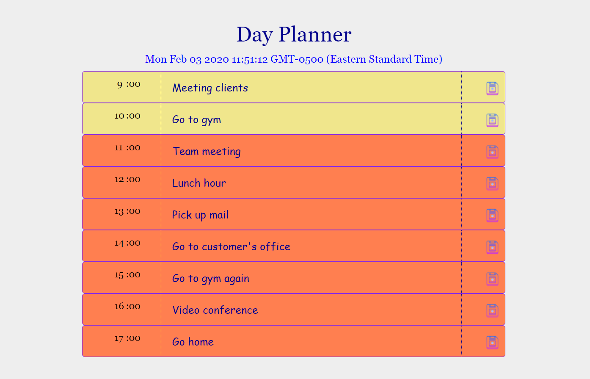
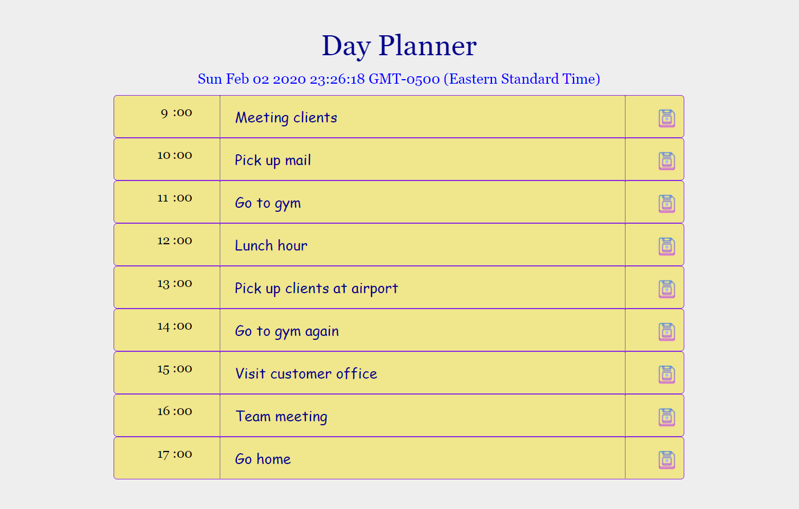

# DayPlanner
**This is a sample day schedule app.** It shows the tasks according to diffent time frames during the day. If the tasks passed the current time of the day, the background color of those taskes will change to light yellow, if not, which means those are future tasks and the background color of future tasks will become orange. 

**Here is the link to view this app. https://mushuyun.github.io/DayPlanner/**

*Here are the screenshots to give you a better idea of this app.*

